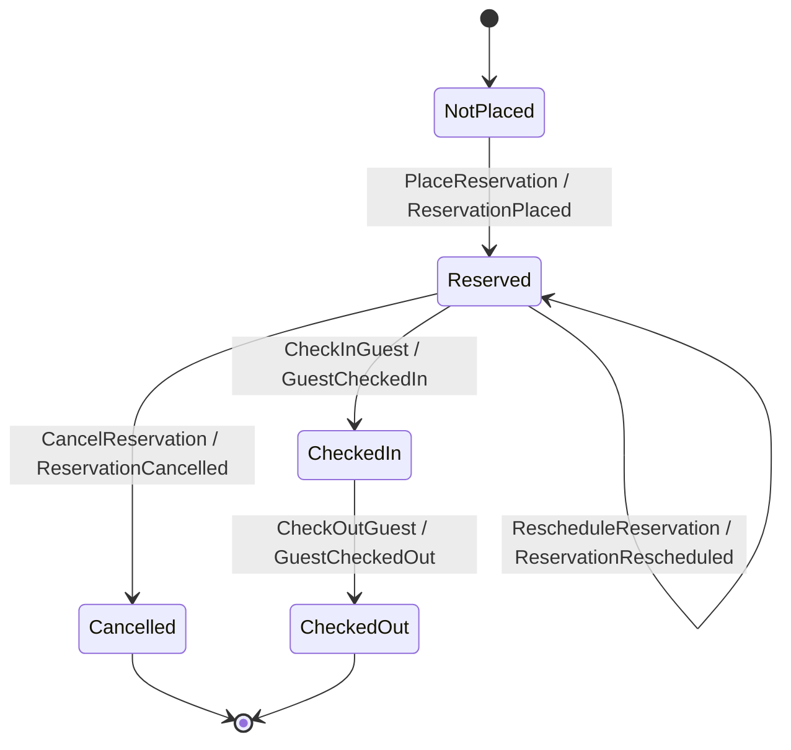

# Reservation Decider Lab

Учебный full-stack стенд для изучения Decider pattern, event sourcing и DDD на
TypeScript. Домен бронирований работает на Effect, HTTP-адаптер — Fastify,
интерактивный MVVM-интерфейс — React, MobX и `mobx-react-lite`. Внешней базы данных
нет: event streams живут только в памяти процесса.

## Быстрый старт

Требуется Node.js 25+ и pnpm 10+.

```bash
pnpm install
pnpm dev
```

- UI: <http://127.0.0.1:5173>
- API health: <http://127.0.0.1:3000/api/health>
- Vite проксирует `/api` на Fastify.

Production composition:

```bash
pnpm build
pnpm start
```

После `build` Fastify отдаёт UI и API с одного origin:
<http://127.0.0.1:3000>.

Проверки:

```bash
pnpm exec vitest run
pnpm typecheck
pnpm lint
pnpm build
```

## Что изучать в UI

Экран показывает один поток слева направо:

1. **Command** — намерение пользователя.
2. **Decide / State** — восстановленное состояние и результат решения.
3. **Events** — неизменяемый append-only journal с version.

Начальный сценарий:

1. Выполнить `PlaceReservation`.
2. Изменить даты и выполнить `RescheduleReservation`.
3. Выполнить `CheckInGuest`.
4. Попробовать `CancelReservation`: Decider вернёт
   `InvalidStateTransition`, а version и journal не изменятся.
5. Выполнить `CheckOutGuest`.
6. Нажать **Load / Replay** и восстановить projection из событий.
7. Нажать **Reset stream ID**. Это создаёт новый ID только в UI; старый stream
   остаётся доступен до остановки сервера.

Все пять команд доступны в любом состоянии намеренно. Так видна принципиальная
разница:

- **accepted decision** выпускает событие и меняет stream version;
- **rejected attempt** возвращает typed error и не попадает в event history.

## Канонический Decider

```ts
type Decider<Command, State, Event, Error> = {
  readonly initial: State;
  readonly decide: (
    state: State,
    command: Command,
  ) => Effect.Effect<ReadonlyArray<Event>, Error>;
  readonly evolve: (state: State, event: Event) => State;
};
```

- `initial` задаёт состояние до первого события.
- `decide(state, command)` проверяет переход и выпускает события либо typed
  domain error. Единственный его явный эффект — `Clock.currentTimeMillis`.
- `evolve(state, event)` — чистая детерминированная функция.
- `replay(events)` сворачивает историю через `evolve`.

Формула Jérémie Chassaing записывается как `Command -> State -> Event list`.
В TypeScript-проекте используется эквивалентный uncurried Effect API
`decide(state, command)`.

## FSM бронирования



`RescheduleReservation` не создаёт отдельную lifecycle-стадию: aggregate остаётся
`Reserved`, сохраняет guest/room и получает новый `DateRange`.

## Путь команды

```text
HTTP
  -> Effect Schema decode
  -> read stream + version
  -> replay domain state
  -> decide(state, command)
  -> optimistic append(expectedVersion)
  -> fold read-side projection
  -> Effect Schema encode
  -> HTTP response
```

API:

- `POST /api/reservations/commands`
- `GET /api/reservations/:reservationId`
- `GET /api/health`

Effect Schema — единственная wire-граница и в Fastify, и в browser adapter.
Fastify разбирает JSON, но не дублирует business validation в Ajv/Zod-схемах.

## Архитектура

```text
src/
├── reservations/
│   ├── domain/          commands, events, state, Decider, value objects
│   ├── application/     use cases, projection, Event Store port
│   ├── infrastructure/  versioned in-memory Event Store adapter
│   ├── http/            Fastify reservation routes and error mapping
│   ├── ui/              ReservationsApi, MobX ViewModel, React views
│   └── contracts.ts     isomorphic Effect Schema DTO boundary
└── platform/
    ├── server/          Fastify + ManagedRuntime composition root
    └── web/             React composition root and styles
```

Верхний уровень «кричит» о bounded context `reservations`, а не о generic
controllers/repositories.

| Принцип | Реализация |
| --- | --- |
| SRP | Decider решает, projection читает, store хранит, HTTP переводит протокол, ViewModel управляет presentation flow. |
| DIP | Use cases зависят от `ReservationEventStore` port; in-memory store подключается Effect Layer-ом. ViewModel зависит от `ReservationsApi`; fetch — внешний adapter. |
| Domain purity | `evolve`, `replay` и projection не выполняют I/O. |
| Boundary validation | Commands, events, IDs, ISO-даты и DTO проходят Effect Schema. |
| Optimistic concurrency | `append` атомарно сравнивает `expectedVersion`; конфликт становится HTTP 409 без retry. |

Fastify создаёт один `ManagedRuntime` на server instance и освобождает его в
`onClose`. `NodeRuntime.runMain` связывает SIGINT/SIGTERM с закрытием Fastify и
Effect scope.

## Ограничение хранения

Event Store использует `Ref<HashMap<ReservationId, Stream>>`.

**Это учебное in-memory хранилище. Любой restart процесса полностью очищает все
бронирования и события.** Нет durability, snapshots, cross-process coordination
или production-grade persistence.

## Материалы

- [Локальный Decider pattern guide](../learn-programming/src/decider-pattern-guide.html)
- [Jérémie Chassaing — Functional Event Sourcing: Decider](https://thinkbeforecoding.com/post/2021/12/17/functional-event-sourcing-decider)
- [Effect: Runtime](https://effect.website/docs/runtime/)
- [Effect: Layers](https://effect.website/docs/requirements-management/layers/)
- [Effect Schema](https://effect.website/docs/schema/introduction/)
- [Fastify testing guide](https://fastify.dev/docs/latest/Guides/Testing/)
- [MobX React integration](https://mobx.js.org/react-integration.html)
